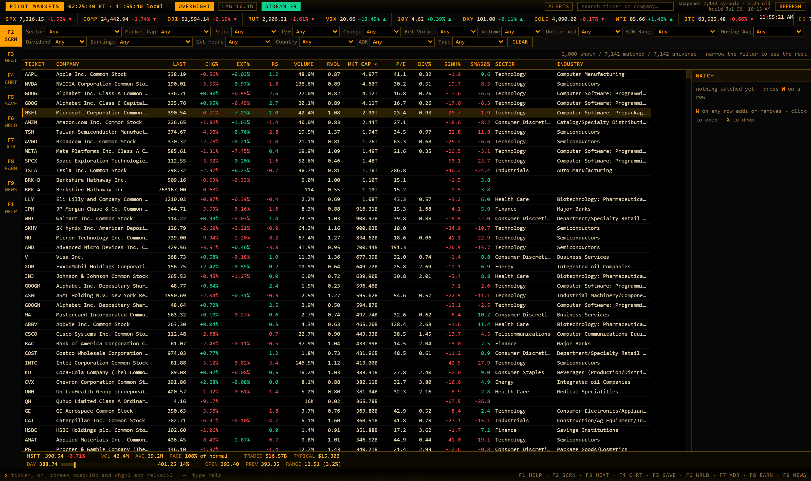
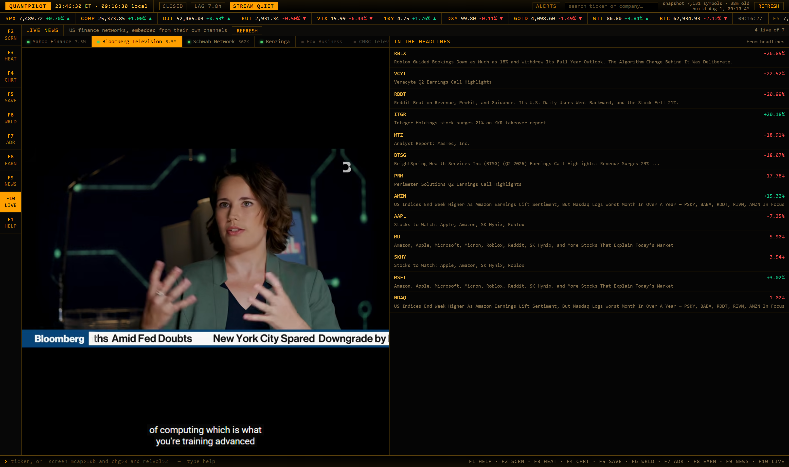

# QuantPilot

[](https://github.com/Ben05-sys/QuantPilot/actions/workflows/ci.yml)
[](https://github.com/Ben05-sys/QuantPilot/actions/workflows/codeql.yml)
[](https://www.python.org/downloads/)
[](#install)
[](LICENSE)
[](https://ben05-sys.github.io/QuantPilot/)

A local market terminal: Finviz-class screening over the whole US universe,
the finance networks live beside the tape, Bloomberg-style chrome, no API
keys, no vendor, no monthly bill.

### [Open the demo →](https://ben05-sys.github.io/QuantPilot/)

The real terminal with its network swapped for a recording: a captured
session of the US market and a couple of minutes of the actual tape,
replaying. Sorting, the command line, the heatmap, the world map and the
charts all work — it is `app/web/index.html` unmodified, so what you are
clicking is the thing itself. Prices are from the moment it was recorded
and the page says so at the top; nothing there is live, and nothing there
calls out to a data provider from your browser. For that, run it:

```bash
pip install -r requirements.txt && python pilot.py
```



Seven thousand symbols, screened locally in milliseconds. The strip along
the bottom is the detail for the row under the cursor — share volume, how
that compares with a normal day *by this hour*, dollar volume, and where
the price sits in the day's range. Depth on demand, so the grid never has
to grow a column for it.




The US finance networks on their own YouTube channels, and what the current
headlines are about next to them. The green dots are read from each channel
rather than assumed, so the wall knows who is actually on air — here four of
seven, coming up on midnight Eastern — and opens on the busiest rather than
on a dead player.

## Install

Needs **Python 3.11 or newer**. Nothing else, and no account anywhere.

Runs on **Linux, macOS and Windows** — the test suites run against all three
on every push. The terminal is a stdlib HTTP server and one HTML file, so
the browser does the work everywhere. Three conveniences are Windows-only
and each degrades to a printed line rather than an error: the tray icon, the
`Ctrl+Alt+M` hotkey, and `--install-shortcut`.

```bash
pip install -r requirements.txt
python pilot.py
```

That's it — the browser opens on its own and the first run builds the
universe snapshot in the background.

Two optional things:

- **SEC filings.** The 10-K/10-Q panel in the ticker view needs a contact
  address, because SEC requires one in the User-Agent and returns 403
  without it. Put your own email in `~/.quantpilot/config.json`:
  `{"sec_contact": "you@example.com"}`. Everything else works without it.
- **Live ticks.** `yfinance`, `websockets` and `protobuf` are in
  `requirements.txt` and give you the streaming price feed. Leave them out
  and the terminal falls back to polling — slower, but it says so in the
  header rather than pretending.

All data lives in `~/.quantpilot`. Delete that folder to reset; nothing
is written anywhere else.

```bash
python pilot.py                     # terminal at http://127.0.0.1:8900
python pilot.py --install-shortcut   # Desktop + Start Menu shortcuts
python pilot.py --refresh           # rebuild the universe snapshot, then exit
python pilot.py --refresh --limit 500   # top 500 by market cap (quick)
python pilot.py --port 9000 --no-browser
```

First run builds the snapshot in the background and shows progress in the
window. A full rebuild is **about 7,000 symbols in 20–35 seconds**.

On Windows it sits in the system tray. **Ctrl+Alt+M** summons it
from anywhere; right-click the tray icon for Open / Refresh / Quit.

---

## What it does

**Screener** (`F2`) — the whole listed universe in a dense sortable grid.
Fifteen Finviz-style dropdowns (sector, market cap, price, P/E, change,
relative volume, volume, 52-week range, moving averages, dividend,
earnings, extended hours, country, ADR, type) plus a command line that
takes free-text expressions. The grid virtualizes, so 7,000 rows scroll
like 40. Prices tick in place, **green on an uptick and red on a
downtick**.

**Heatmap** (`F3`) — squarified treemap grouped by sector, sized by market
cap, coloured by percent change.

**Ticker detail** (`F4`) — candles with SMA50/SMA200 and a volume
histogram, 1D through MAX, extended-hours sessions shaded, key stats, a
52-week range bar, recent 10-K/10-Q links from SEC EDGAR, and a news feed
underneath the chart.

**Extended and overnight hours** — pre-market, after-hours *and the
overnight session* reach the `EXT%` column and the filter bar, so *"up 5%
after hours"* is a screen. US equities trade on ATS venues from roughly
20:00 to 04:00 ET — the middle of the day across Asia — and measured at
00:10 ET, 16 of 30 large caps were actively trading. The header calls
that **OVERNIGHT**, not CLOSED.

The regular-session price is never merged with any of them. `LAST` is
always the regular close; an overnight print is a different fact about a
different session, and letting it overwrite `LAST` is how a terminal ends
up quietly showing one venue's price under another's label.

**Ex-dividend calendar** (`Alt+D`) — what goes ex over the next six weeks,
grouped by exchange day, with all four dates a dividend has: declared, ex,
record and payment. Each row also carries the cash amount, that amount as
a percent of today's price (the drop to expect), the indicated annual
yield, and the payout ratio — because "pays 6%" and "pays 6% it is not
earning" are different stocks.

**IPO board** (`Alt+I`) — upcoming, priced, filed and withdrawn, with the
range a deal is asking, how many shares, and what that comes to. Kept out
of the screener deliberately: a company that has not listed has no price,
no volume and no market cap, and the screener's contract is that every row
is a line you can actually trade. Symbols that *have* listed are live
links through to the chart; the rest are dimmed.

**World map** (`F6`) — 60 countries sized by market cap and coloured by
average change, as geographic bubbles or as equal tiles. Click a country
to screen it.

**ADRs** (`F7`) — the 276 foreign companies listed on US exchanges
through depositary receipts, with country as a first-class column.

**Earnings** (`F8`) — who reports over the next days, grouped by exchange
day, split into **BMO** (before the open) and **AMC** (after the close),
sorted by market cap. Plus an *avoid earnings* filter on the screener,
because plenty of setups are invalidated by a print you didn't know was
coming.

**Market news** (`F9`) — the whole market's news, ranked by how hot it
is. Yahoo's wire carries no tickers and their search takes one symbol at a
time, so the feed asks about whatever is moving hardest — which the
snapshot already knows for free — and merges the two. Hotness is recency
times the size of the move the story is about, so a 20-minute-old piece on
a stock down 17% outranks a fresh opinion column, and roundups tagged with
eight tickers are discounted. Every row carries the ticker it is about and
that ticker's move.

**Live news** (`F10`) — the US finance networks, embedded from their own
channels: Bloomberg Television, Yahoo Finance, Schwab Network, Benzinga,
Fox Business, CNBC, Reuters. Who is actually on air is read from each
channel rather than assumed, so the wall shows a green dot against the ones
broadcasting and opens on the busiest — never a dead player. Alongside it,
the tickers the current headlines are about, with their moves, each one a
click from its chart.

It reads the picture, not the sound. YouTube renders live captions inside
its own player but exposes no retrievable track: a live watch page carries
no caption list, and `timedtext` answers with zero bytes. Their own
documentation puts a downloadable transcript 12–24 hours after the
broadcast ends. So the terminal does not claim to know what is being
*said* — it shows what is being *traded* next to the picture, which it can
establish honestly from the snapshot it already holds. Company names in
headlines resolve against the 7,000-symbol universe, so "Nvidia" becomes
NVDA with a live price beside it, while "he was open to a deal" is
correctly not Opendoor.

The embed is the one thing in the terminal that talks to a third party. It
uses `youtube-nocookie.com`, which sets no tracking cookie unless you press
play, and the iframe is only built when you open the view and a channel is
live — the served page reaches nobody on its own. `tests/test_server.py`
enumerates every permitted external host so this cannot quietly widen.

**Search** — a box in the header for tickers and companies, ranked so the
US listing wins: Yahoo otherwise returns NVIDIA's Toronto CDR and
Frankfurt line above US names. `/` focuses it, arrows pick, Enter opens.

**Company news** — recent stories under every company's chart, with how long ago
each broke and which other tickers it is tagged with, so a roundup naming
eight companies is visibly not news about the one you are looking at.
**Click one and it opens inside the terminal**: the page itself cannot be
embedded (publishers send `X-Frame-Options`), so the server fetches it and
extracts the body text into a reader panel. The original is always one
click away.

**Screen diffs** — every saved screen records what it matched at each
scheduled refresh, so `F5` shows what entered and left since the previous
run. The point of the append-only snapshot design, finally cashed in.

**Related companies** — every company that names this one in its own SEC
annual report, with tickers, live prices and a link to the filing. A true
supplier graph is a paid dataset; what EDGAR gives free is *disclosed
relationships* — Apple surfaces Liquidmetal and Qualcomm, Tesla surfaces
Aptiv and QuantumScape. It cannot tell a supplier from a customer from a
competitor, so it says so, and marks same-sector names as peers.

**Relative strength** — `rs` is a stock's move minus its own sector's
cap-weighted move. "Up 3%" on a day the sector rose 3% is not strength.
Screenable: `rs > 3 and mcap > 2b`.

**Compare on the chart** — overlay another ticker, normalised to percent,
with who is ahead and by how much.

**Alerts** — turn the bell on and the terminal notifies you when a symbol
enters a saved screen, fired off the scheduled refresh so it works while
you sleep through the US session.

**Watchlist** — press `W` on any row. Live prices, optional shares and
cost basis with P&L. Watched symbols stay on the tick stream even when
you navigate away.

**Command line** — `NVDA`, `screen <expr>`, `news <sym>`, `watch <sym>`,
`save`/`load`/`del <name>`, `clear`, `refresh`, and
`scrn`/`heat`/`map`/`chart`/`adr`/`saved` to switch view. `F1`–`F10` switch
views, `/` focuses the prompt, `↑`/`↓` walk history.

**Keyboard** — `↑`/`↓` move the grid cursor, `PgUp`/`PgDn`, `Home`/`End`,
`Enter` opens the ticker, `W` watchlists. Your filters, sort, view and
layout persist across restarts.

---

## The expression language

The dropdowns and the command line are the same mechanism: the filter bar
compiles to an expression string, so anything you can click you can type,
save, and reload.

```
mcap > 10b and chg > 3 and relvol > 2
2 < pe < 30 and price / sma50 > 1.05
sector == "Energy" and div > 3
sector in ("Technology", "Finance") and from52high > -5
"semi" in industry and vol > 1m
0 < exdiv < 7 and payout < 75 and mcap > 10b
not (0 < exdiv < 7) and relvol > 2
```

- The corporate calendar is part of the language, not a separate screen.
  `exdiv` is days until a stock trades without its next dividend — negative
  once it has — alongside `divamt`, `divdrop` (that payment as a percent of
  today's price), `fwdyield`, `exdate`, `recorddate` and `paydate`. An
  ex-date is a *scheduled gap down*, so the last example above is the one
  worth stealing: a momentum screen that does not exclude it is partly
  measuring dividends.
- A name with nothing scheduled is **null**, never zero — "no dividend in
  the next six weeks" and "pays no dividend" are different facts and only
  one of them is a reason to skip a stock.
- Suffixes `k m b t` work anywhere a number does; `3%` is the same as `3`.
- `relvol` is **time-adjusted**: volume so far against what a normal
  session would have traded *by now*, not against the whole day. Without
  that, every momentum screen returns nothing before noon. `relvolraw`
  keeps the unadjusted ratio.
- Chained comparisons read as you'd expect.
- Text comparisons are case-insensitive. `in` is membership on a field and
  substring search on a string.
- `and` `or` `not`, arithmetic between fields, parentheses.

Expressions are parsed with `ast` and walked under an allowlist. `eval()` is
never called on user text, and neither is `DataFrame.query`, which executes
attribute access and would happily run `@__import__`. Anything outside the
allowlist is rejected by name:

```
> screen __import__("os").system("dir")
call is not allowed in a screen
```

Field names, aliases and all of it: press `F1`.

---

## Data sources

| Source | What it gives | Cost | Freshness |
|---|---|---|---|
| Nasdaq screener | 7,000+ symbols with sector, industry, market cap | free, no key | one call, ~2.3s |
| Nasdaq dividend calendar | declared / ex / record / payment dates, market-wide | free, no key | one call **per exchange day** |
| Nasdaq IPO calendar | upcoming · priced · filed · withdrawn | free, no key | one call per month |
| Yahoo `/v7/quote` | 83 fields per symbol, 200 per call | free, no key | near-real-time; needs a cookie+crumb pair |
| Yahoo websocket | streaming trades, incl. extended hours | free, no key | **sub-second**, but Yahoo throttles |
| Yahoo `/v8/chart` | OHLCV bars, any interval | free, no key | 3–25s behind the tape |
| SEC EDGAR | filings, XBRL fundamentals | free | wants a contact string, not a browser UA |
| Yahoo search | per-company news with related tickers | free, no key | minutes old |
| Cboe | option chains **with greeks** | free, no key | **delayed** · parked, see below |
| Yahoo futures | ES, NQ, CL, GC and friends | free, no key | **~10 min delayed** (CME's free tier) |

**Latency is measured, never assumed.** Every quote carries the gap between
the venue's timestamp and the local clock, and the header renders whatever
comes back — `LAG 4s`, `LAG 12m`, `CLOSED`. The stream badge reads `STREAM`
only while ticks are genuinely arriving and falls back to `POLL` otherwise:
a grid that has silently stopped updating while still labelled live is worse
than one that admits it is polling. Options and futures panels say DELAYED
and mean it.

Real-time futures would need a CME subscription; the delayed feed is the
free ceiling.

---

## How it stays fast

Three clocks, deliberately separate:

1. **Universe snapshot** — the full rebuild. `app/clock.py` fires one at the
   open, mid-session and the close, driven by the exchange's own
   `marketState` rather than a calendar, so holidays and half-days come out
   right with no table to maintain. Between rebuilds a rolling pass re-quotes
   the universe in slices so the snapshot never drifts far from the tape.
   This is what the screener filters against: locally, in pandas, with no
   network in the hot path.
2. **Screen-time re-pricing** — a screen mentioning `chg` or `relvol` is a
   question about *now*. The static half of the expression narrows the field
   first, then the survivors get live quotes before the price predicates run.
   The response says which prices it used — `live`, `snapshot` or `static` —
   and the count line repeats it.
3. **Two-pass screening** — the snapshot answer comes back in about 20ms
   and goes straight on screen; the live-priced answer follows a moment
   later and replaces it. Waiting for the accurate one means staring at
   nothing for over a second, so you get rows immediately and the count
   line says which prices you are looking at.
4. **Streaming ticks** — the websocket pushes trades for whatever is on
   screen plus everything on your watchlist, and cells flash green or red in
   place. It never re-screens: a row that stops matching mid-session stays
   put, which is what you want when you're watching something move.

### How far behind the tape you actually are

Measured, on the machine this was written on, during a regular session:

| | |
|---|---|
| Yahoo's feed — venue timestamp to our socket | median **2.9s**, p90 3.9s |
| The terminal — socket to the browser | median **2ms**, worst case 51ms |

The first number is not ours to improve and the header states it rather
than implying it away: the `STREAM` badge carries the median measured over
the last two hundred prints, so what you see is `STREAM 40 · 2.9s`, not a
green light. The second one *is* ours, and it used to be a flat 0.7-second
sleep between the socket and the browser — a fifth of the total delay,
spent waiting for a timer with the price already in hand. Ticks now flush
on arrival and only coalesce under a burst.

Two smaller things in the same direction. The market-state probe refreshes
on its own thread, because it costs a round trip and whichever thread found
the cache expired used to pay for it — one batch of prices every five
seconds left a quarter of a second late. And every print now carries the
session totals Yahoo was already sending, so volume, relative volume and
the day's range move with the price instead of sitting at whatever the last
snapshot recorded.

5. **The corporate calendar** — a fourth clock, moving in days rather than
   minutes or seconds. The dividend calendar is a call *per exchange day*
   against a host rate-limited to two a second, so a six-week window is
   about twenty seconds — half again the cost of a whole universe rebuild,
   for data that changes once a day. It refreshes on its own schedule on a
   background thread and the screener joins whatever is currently known.
   Before the first refresh lands every dividend column is null, which
   renders as an em dash and not as "no dividend".

Snapshots are **append-only**, keyed by timestamp. Every refresh writes a new
generation instead of overwriting the last. That costs a few MB a day and buys
two things that are otherwise expensive: screen-membership diffs ("what
entered my screen, and when"), and genuine point-in-time history — the only
honest way to backtest a screen without look-ahead bias. Vendors charge real
money for point-in-time fundamentals; accumulating your own from day one is
free. `store.prune_snapshots()` keeps the most recent 90.

---

## Layout

```
pilot.py              launcher · --refresh · --install-shortcut
QuantPilot.spec     PyInstaller
app/
  config.py           settings, ~/.quantpilot/, port 8900
  net.py              rate-limited, disk-cached HTTP, per-host User-Agent
  store.py            SQLite: snapshots, screens, bars, positions
  universe.py         Nasdaq list + Yahoo enrichment -> snapshot -> pandas
  screen.py           expression engine, filter specs, presets, live overlay
  calendars.py        dividend + IPO calendars, refreshed off the hot path
  stream.py           Yahoo websocket: viewport + pinned subscriptions
  clock.py            market-state scheduler and rolling re-quote
  diffs.py            screen membership, run over run
  news.py             market feed: wire + movers, scored for hotness
  article.py          in-terminal reader; fetch is keyed to served ids
  options.py          chain shaping and unusual-activity ranking (parked)
  watchlist.py        thin layer over the positions table
  tray.py             Win32 tray icon and Ctrl+Alt+M, pure ctypes
  livenews.py           which finance networks are on air, and who they name
  server.py           stdlib HTTP + SSE, 23 routes
  web/index.html      the entire terminal, self-contained
  providers/          nasdaq · yahoo · cboe · sec, behind one Protocol
tools/make_icon.py    generates the .ico with the stdlib alone
tools/build_demo.py   freezes a running terminal into docs/demo/
tools/demo_shim.js    the recording that stands in for the server
docs/demo/            what GitHub Pages serves — a build artifact
tests/                plain scripts, no pytest (plus one jsdom smoke test)
```

Data lives in `~/.quantpilot/` (`market.db`, `httpcache.db`, `config.json`).
Nothing is written inside the repo.

### The demo

`docs/demo/` is generated, and generated **locally** — during US market
hours, on the machine of whoever is refreshing it:

```bash
python pilot.py --refresh
python tools/build_demo.py --seconds 120
```

That boots the real server on an ephemeral port, captures its answers as
fixtures, records a couple of minutes of the real tape off the websocket,
and writes the whole thing beside `app/web/index.html` — copied verbatim,
so the page on Pages is the page you run. `demo_shim.js` replaces
`window.fetch` and `EventSource`: it answers from the fixtures, screens
and sorts the rows in the browser against the engine's own alias table,
and replays the recorded prints at the intervals they actually arrived.

`window.fetch` is *replaced*, not wrapped. A fixture that is missing fails
visibly rather than falling through to Yahoo from a stranger's browser —
which is also why the workflow only ever copies the committed folder and
never builds it on a runner. See the caveat at the bottom.

## Tests

```bash
python tests/test_screen.py    # expression engine, ADRs, country grouping
python tests/test_store.py     # snapshots, screens, positions (temp database)
python tests/test_stream.py    # subscriptions, overlay, backoff
python tests/test_options.py   # chain shaping, unusual activity
python tests/test_calendars.py # dividend + IPO parsing, against pasted payloads
python tests/test_clock.py     # session transitions, replayed in milliseconds
python tests/test_server.py    # every route, on an ephemeral port
python tests/test_article.py   # the reader's address check, every hop of it
node   tests/ui_smoke.js       # boots the page in jsdom
```

Network-dependent checks in `test_server.py` report as skipped, not failed,
when there is no connection. `test_clock.py` supplies both the market state
and the clock reading, because waiting until 4pm Eastern to find out whether
the close snapshot fires is not a test.

`ui_smoke.js` exists because `node --check` only finds syntax errors. The
failure that actually bites is a runtime throw at load: it kills every
handler registered after it, and the page then renders perfectly while doing
nothing. It borrows the jsdom install from `OfflinePilotX/tests`, so there is
no new dependency.

## Parked

`app/options.py` and `providers/cboe.py` build full option chains with
delta, gamma, theta, vega, rho, IV and open interest, plus an
unusual-activity ranking — contracts trading above their entire open
interest. It works and `tests/test_options.py` covers it, but the view was
taken back out of the terminal as too much for now. Re-surfacing it is a
route and a view, not a rewrite.

## Security

The server binds `127.0.0.1` only, checks that the `Host` header names a
loopback address (so a DNS-rebinding page can't reach it), and requires a
per-launch token that is injected into the served page and echoed on every
API call. The SSE stream accepts the same token as a query parameter, because
`EventSource` cannot set request headers.

Found something? Please report it privately — **[SECURITY.md](SECURITY.md)**
has the threat model and the advisory link, and says what is in scope.

The article reader takes a **story id, never a URL**. A route that fetched
whatever address it was handed would be an open proxy running on your
machine — usable to probe your own network. Only stories the server has
already served as news can be fetched, and even then the host is checked
against loopback and private ranges.

## Contributing

Issues and pull requests are welcome — see **[CONTRIBUTING.md](CONTRIBUTING.md)**
for the full version, and the
[good first issues](https://github.com/Ben05-sys/QuantPilot/issues?q=is%3Aissue+is%3Aopen+label%3A%22good+first+issue%22)
for somewhere to start. The codebase is small enough to read in an
afternoon — `## Layout` above is the map, and every module opens with a
docstring explaining why it exists rather than what it does.

By taking part you agree to the
[Code of Conduct](CODE_OF_CONDUCT.md); released versions are listed in the
[changelog](CHANGELOG.md).

Tests are plain scripts, no pytest:

```bash
python tests/test_screen.py     # and test_server, test_store, test_stream, ...
node  tests/ui_smoke.js         # boots the whole UI in jsdom; needs `npm i jsdom`
pip install -r requirements-dev.txt && ruff check .   # what CI lints with
```

Run them before opening a PR. `ui_smoke.js` is the one that catches a
runtime throw at page load — the failure that leaves the UI rendering
perfectly while every handler after the bad line is dead.

Two house rules, both load-bearing:

- **Never claim live over stale data.** Lag is measured per response and
  shown. If a number might be old, the UI has to say so.
- **A field we cannot compute stays null.** Nothing is imputed, guessed or
  defaulted into looking like a fact.

Good first issues: un-parking the options view (`app/options.py` and
`providers/cboe.py` are written and tested, they just need a route and a
view), indicators inside the expression engine, and a tray icon for macOS
or Linux — the terminal itself already runs on both, so what is missing is
the convenience layer `app/tray.py` provides on Windows, not a port.

## Licence

**GNU AGPL-3.0** — see [LICENSE](LICENSE).

Use it, read it, fork it, change it. The one condition: if you distribute a
modified version, **or run one as a service other people can reach over a
network**, you have to publish your source under the same licence. That
network clause is the whole reason for choosing AGPL over MIT — it means
nobody can take this closed and sell it back as a hosted product.

For ordinary use — running it on your own machine, hacking on it, sending a
pull request — it asks nothing of you.

## A caveat worth reading

Yahoo's endpoints are undocumented and its terms prohibit automated access and
monetization. That is fine for a single-user terminal on your own machine, and
**not** fine as the basis of anything published or sold. Every upstream sits
behind `providers.base.QuoteProvider`, so the day one of them closes — or the
day this needs to be legitimate — only one file changes.

That line is also where the demo stops. It is a recording — one session,
captured once, by hand, and committed — and it makes no request to anyone
when you open it. A live hosted terminal would be a data service built on
someone else's feed, which is the thing the paragraph above rules out. The
live feed is for the copy running on your own machine.
